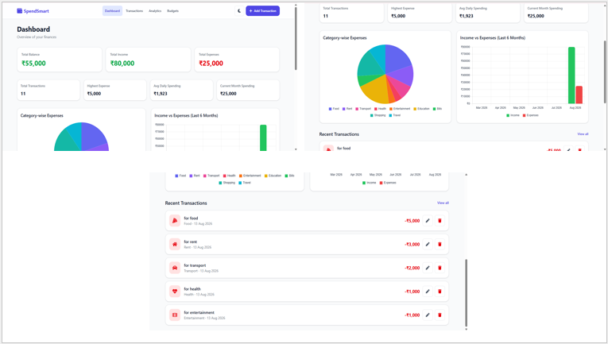
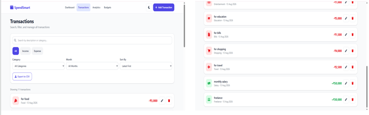
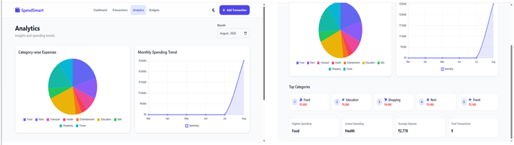
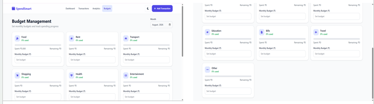
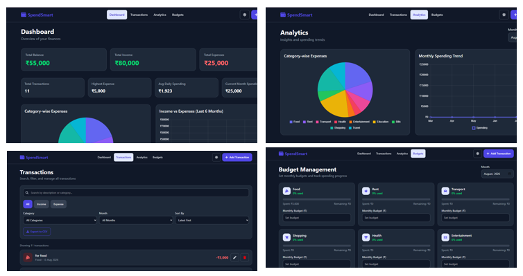

# 💰 SpendSmart — Personal Expense Tracker

<p align="center">
  <strong>A modern, responsive personal finance dashboard for smarter expense tracking and financial insights.</strong>
</p>

<p align="center">
  Track your income, manage expenses, set budgets, analyze spending patterns, and export your transaction data — all from a clean and intuitive web interface.
</p>

<p align="center">
  
  
  
  
</p>

---

## 🌟 Overview

**SpendSmart** is a client-side personal expense tracking application designed to help users understand and manage their everyday finances.

The application provides a centralized dashboard for recording transactions, monitoring income and expenses, managing monthly budgets, exploring financial trends, and exporting transaction records.

SpendSmart focuses on a **simple, responsive, and data-driven user experience** while keeping personal financial data stored locally in the browser.

---

## ✨ Key Features

### 💸 Transaction Management

* ➕ Add income and expense transactions
* ✏️ Edit existing transactions
* 🗑️ Delete transactions with confirmation
* 🏷️ Categorize transactions
* 📅 Record transaction dates
* 📝 Add transaction descriptions
* 💰 Automatic amount validation

### 📊 Financial Dashboard

Get a quick overview of your financial activity through:

* 💵 Current balance
* 📈 Total income
* 📉 Total expenses
* 🧾 Total transaction count
* 💳 Highest expense
* 📅 Average daily spending
* 📆 Current-month spending
* 🕐 Recent transactions

### 📈 Interactive Analytics

Turn transaction data into meaningful financial insights with interactive charts:

* 🥧 Category-wise expense distribution
* 📊 Income vs. expense comparison
* 📈 Monthly spending trends
* 📅 Six-month financial comparison
* 🏆 Top spending categories
* 🔝 Highest and lowest spending categories
* 📊 Average expense insights
* 🧾 Monthly transaction analysis

### 💳 Budget Management

Plan and monitor your spending with:

* 🎯 Monthly budgets
* 🏷️ Category-based budgets
* 📊 Budget progress tracking
* 💰 Amount spent
* 💵 Remaining budget
* 📈 Budget utilization percentage
* ⚠️ Spending threshold alerts
* 📋 Budget status indicators

### 🔎 Search, Filter & Sort

Find transactions quickly using:

* 🔍 Keyword search
* 💸 Income / expense filtering
* 🏷️ Category filtering
* 📅 Month-based filtering
* 🕐 Latest-to-oldest sorting
* 💰 Highest-to-lowest amount sorting
* 💵 Lowest-to-highest amount sorting

### 📥 CSV Export

Export transaction records into a **CSV file** for:

* 📊 Further analysis
* 💾 Personal record keeping
* 📑 Spreadsheet usage
* 🔄 Data portability

### 🌙 Light & Dark Mode

* ☀️ Light theme
* 🌙 Dark theme
* 💾 Persistent theme preference
* 📱 Responsive navigation
* 🍔 Mobile-friendly menu

### 💾 Local Data Persistence

SpendSmart uses the browser's **LocalStorage API** to persist:

* Transactions
* Budgets
* Theme preference

No external database or backend server is required.

> 🔐 Your financial data stays within the browser used to access the application.

---

## 🛠️ Tech Stack

| Technology          | Purpose                              |
| ------------------- | ------------------------------------ |
| ⚛️ React            | User interface development           |
| ⚡ Vite              | Development server and build tooling |
| 🎨 Tailwind CSS     | Responsive UI styling                |
| 📊 Chart.js         | Financial data visualization         |
| 📈 React Chart.js 2 | Chart.js integration with React      |
| 🧭 React Router     | Client-side application routing      |
| 📅 date-fns         | Date manipulation and calculations   |
| 🆔 UUID             | Unique transaction identifiers       |
| 🎯 React Icons      | Interface icons                      |
| 💾 LocalStorage     | Client-side data persistence         |
| 🧹 ESLint           | Code quality and linting             |

---

## 🏗️ Application Architecture

SpendSmart follows a modular React architecture that separates pages, reusable UI components, application state, hooks, and utility functions.

```text
SpendSmart
│
├── public/
│   ├── favicon.svg
│   └── icons.svg
│
├── src/
│   ├── assets/
│   │   └── hero.png
│   │
│   ├── components/
│   │   ├── AddTransactionForm.jsx
│   │   ├── BarChart.jsx
│   │   ├── BudgetCard.jsx
│   │   ├── DeleteModal.jsx
│   │   ├── EmptyState.jsx
│   │   ├── FilterBar.jsx
│   │   ├── Navbar.jsx
│   │   ├── PieChart.jsx
│   │   ├── SkeletonCard.jsx
│   │   ├── StatisticsCards.jsx
│   │   ├── SummaryCards.jsx
│   │   └── TransactionItem.jsx
│   │
│   ├── context/
│   │   └── AppContext.jsx
│   │
│   ├── hooks/
│   │   └── useLocalStorage.js
│   │
│   ├── pages/
│   │   ├── Analytics.jsx
│   │   ├── Budgets.jsx
│   │   ├── Dashboard.jsx
│   │   ├── TransactionForm.jsx
│   │   └── Transactions.jsx
│   │
│   ├── utils/
│   │   ├── calculations.js
│   │   ├── chartHelpers.js
│   │   ├── constants.js
│   │   └── csvExport.js
│   │
│   ├── App.jsx
│   ├── index.css
│   └── main.jsx
│
├── .github/
│   └── workflows/
│       └── deploy.yml
│
├── .gitignore
├── eslint.config.js
├── index.html
├── package.json
├── package-lock.json
├── vite.config.js
└── README.md
```

---

## 🚀 Getting Started

Follow the steps below to run SpendSmart locally.

### 1️⃣ Clone the Repository

```bash
git clone https://github.com/janakid446-hub/spendsmart-expense-tracker
```

### 2️⃣ Navigate to the Project

```bash
cd spendsmart-expense-tracker
```

### 3️⃣ Install Dependencies

```bash
npm install
```

### 4️⃣ Start the Development Server

```bash
npm run dev
```

The application will be available at the local URL displayed by Vite.

---

## 🏗️ Production Build

To create an optimized production build:

```bash
npm run build
```

To preview the production build locally:

```bash
npm run preview
```

The generated production files will be placed inside:

```text
dist/
```

> `dist/` is generated during the build process and should not be committed to the source repository.

---

## 🌐 GitHub Pages Deployment

SpendSmart is configured for deployment using **GitHub Actions and GitHub Pages**.

Every push to the `main` branch triggers the deployment workflow:

```text
Git Push
   ↓
GitHub Actions
   ↓
Install Dependencies
   ↓
Build React Application
   ↓
Generate dist/
   ↓
Deploy to GitHub Pages
   ↓
🚀 Live Application
```

### Deployment Configuration

The Vite configuration uses the repository path as its base:

```js
base: '/spendsmart-expense-tracker/'
```

The deployment workflow is located at:

```text
.github/workflows/deploy.yml
```

### 🔗 Live Demo

> 🚀 **[Launch SpendSmart] https://janakid446-hub.github.io/spendsmart-expense-tracker/**

---

## 📸 Screenshots

### 🏠 Dashboard



### 💳 Transactions



### 📈 Analytics



### 🎯 Budgets



### 🌙 Dark Mode



---

## 💡 Why SpendSmart?

SpendSmart was designed with practical personal finance workflows in mind rather than functioning as a simple CRUD application.

The project demonstrates:

* 🧩 Component-based React architecture
* 🔄 Shared application state management
* 💾 Browser-based data persistence
* 📊 Data visualization
* 📈 Financial calculations
* 🔎 Advanced transaction filtering
* 📥 Client-side CSV generation
* 📱 Responsive interface design
* 🌙 Theme persistence
* 🚀 Static application deployment

---

## 🔐 Data & Privacy

SpendSmart is a **client-side application**.

Financial records are stored locally using the browser's LocalStorage API.

The application does not require:

* ❌ A backend server
* ❌ A database
* ❌ User registration
* ❌ External financial accounts

Because data is stored locally, clearing the browser's site data can remove saved transactions and budgets.

---

## 🧪 Development

Before committing changes, run:

```bash
npm run lint
```

Then verify the production build:

```bash
npm run build
```

This helps ensure the project remains deployable and maintainable.

---

## 🤝 Contributing

Contributions and suggestions are welcome.

To contribute:

1. 🍴 Fork the repository
2. 🌿 Create a feature branch
3. ✨ Make your changes
4. 🧪 Test the application
5. 📦 Commit your changes
6. 🚀 Open a Pull Request

---

## 👨‍💻 Author

**Janaki D**

B.Tech — Artificial Intelligence & Data Science

---

<p align="center">
  <strong>💰 Spend smarter. Track better. Understand your finances. 📊</strong>
</p>

<p align="center">
  ⭐ If you find this project useful, consider giving the repository a star!
</p>
